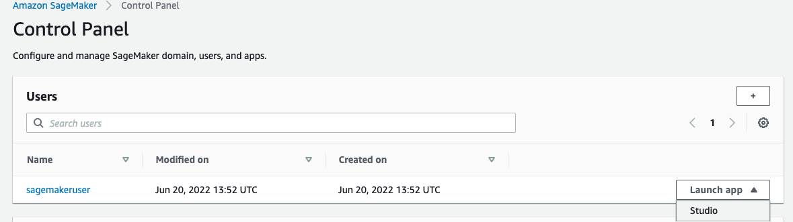
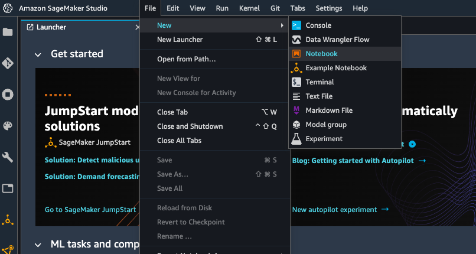
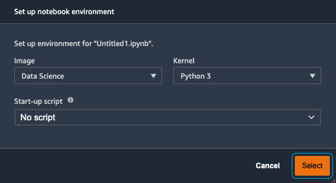

# Account Access
In this section, we will access your temporary AWS account where you will run your labs.

## Steps
### Event Engine access
<<<<<<< HEAD
- **Open an incognito window in your browser** so that the event engine account does not conflict with your personal/business AWS account
- Follow all the steps in [Start with an AWS EventEngine](https://catalog.us-east-1.prod.workshops.aws/v2/workshops/f3a3e2bd-e1d5-49de-b8e6-dac361842e76/en-US/preparation-guide/20-event-engine) module. Use your work email address that was used for event registration.
- Select **us-east-1** in [Additional settings](https://catalog.us-east-1.prod.workshops.aws/v2/workshops/f3a3e2bd-e1d5-49de-b8e6-dac361842e76/en-US/preparation-guide/30-addition-setting)
- In the AWS Management console searh bar, type 'SageMaker' in search bar, hover your mouse on SageMaker, right click and open SageMaker in a new tab. 
- Click on `Studio` under `control panel`
- Click on `Launch SageMaker Studio`
- Now, you should see a user pre-created there with name `sagemakeruser`. Click on `launch app` and then `studio` as shown below.

- Wait for studio IDE to open-up. Next, click on file > new notebook. 

- You will see a pop-up as below. Leave the default as below and click `select`

- Copy the below line and paste into the cell inside notebook. Remember to put the '!' at the beginning.

`!git clone https://github.com/incognitoCodes/AI-ML-solution-services-workshop.git`

- This will clone the repo and create a new folder called "AI-ML-solution-services-workshop" in the notebook directory. We will use these notebooks during the workshop.

=======
1. Open an incognito window in your browser so that the event engine account does not conflict with your personal/business AWS account
1. Follow all the steps in [Start with an AWS EventEngine](https://catalog.us-east-1.prod.workshops.aws/v2/workshops/f3a3e2bd-e1d5-49de-b8e6-dac361842e76/en-US/preparation-guide/20-event-engine) module. Use your work email address that was used for event registration.
1. Select **us-east-1** in [Additional settings](https://catalog.us-east-1.prod.workshops.aws/v2/workshops/f3a3e2bd-e1d5-49de-b8e6-dac361842e76/en-US/preparation-guide/30-addition-setting)
>>>>>>> 1b1ede7eac0ca4e69fad11a8c7115d5fc8db8f19

