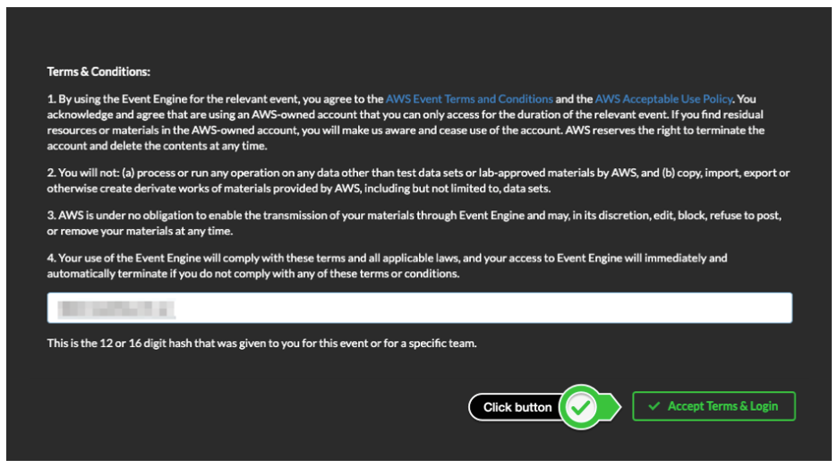
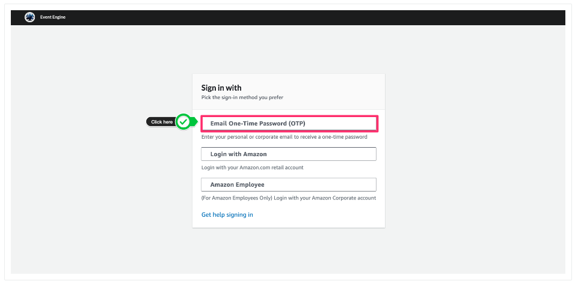
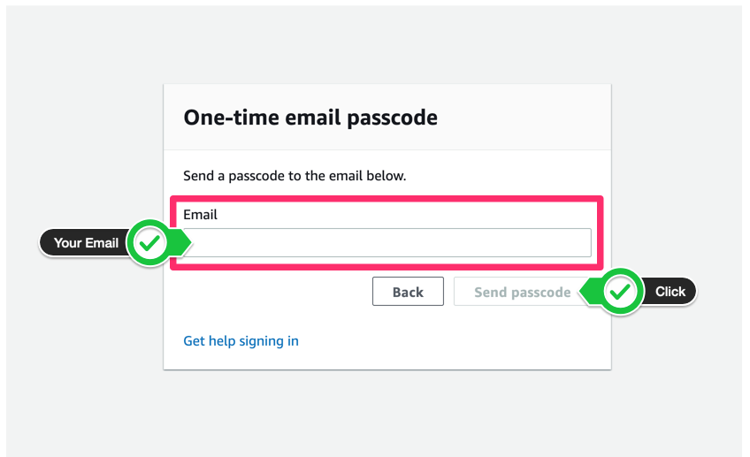
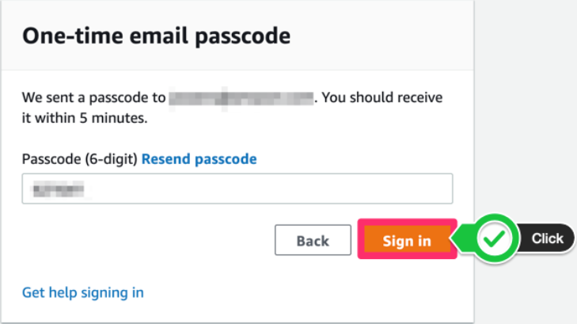
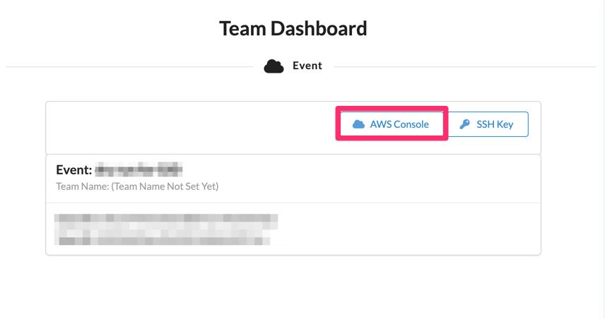
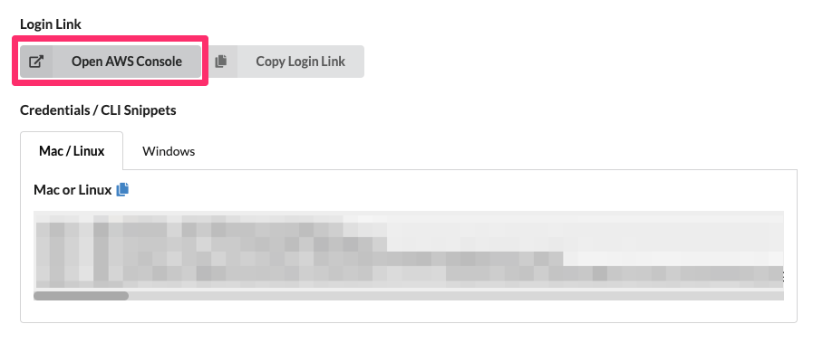
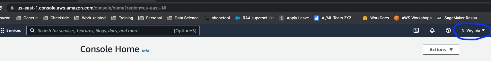

# Account Access
In this section, we will access your temporary AWS account where you will run your labs.

## Steps
### Event Engine access

- **Open an incognito window in your browser** so that the event engine account does not conflict with your personal/business AWS account
- Click on this link [Dashboard-Event-Engine](https://dashboard.eventengine.run/login)
- Paste the event hash code that you received over email in the field.
- Click "Accept terms and login"

- Click Email One-Time Password (OTP) button.

- Put your own email account in the email field and click the send passcode button.

- In your email inbox, check for your one-time passcode email. It may take up to 1 or 2 min to receive the email. Copy the passcode and paste the copied passcode as shown below, then press the Sign in button.

- On the next screen, press the AWS Console button 

- On the next screen, click on "OpenAWSConsole". This should open-up the AWS management console.

- In the AWS management console homepage, you should see N.Virginia as the region selected.

- In the AWS Management console searh bar, type 'SageMaker' in search bar, hover your mouse on SageMaker, right click and open SageMaker in a new tab. 
- Click on `Studio` under `control panel`
- Click on `Launch SageMaker Studio`. 
- Now, you should see a user pre-created there with name `sagemakeruser`. Click on `launch app` and then `studio` as shown below.

- Wait for studio IDE to open-up. It will take few mins to launch the studio IDE when you open it for the first time. Next, click on file > new notebook. 

- You will see a pop-up as below. Leave the default as below and click `select`

- Copy the below line and paste into the cell inside notebook. Remember to put the '!' at the beginning.

`!git clone https://github.com/incognitoCodes/AI-ML-solution-services-workshop.git`

- This will clone the repo and create a new folder called "AI-ML-solution-services-workshop" in the notebook directory. We will use these notebooks during the workshop.
