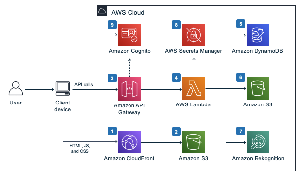
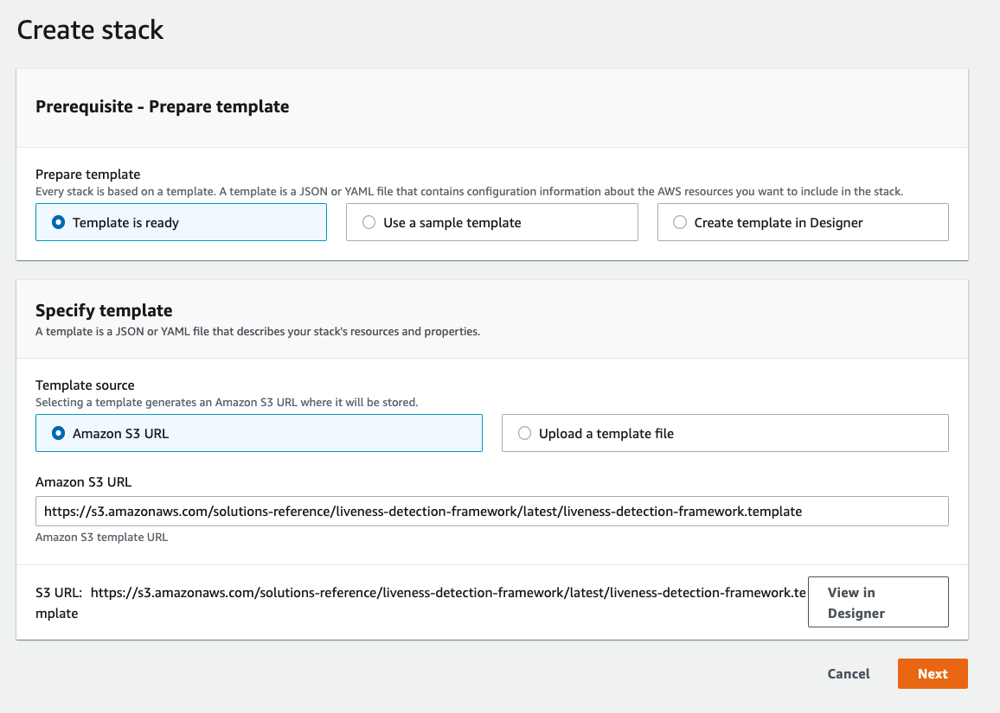
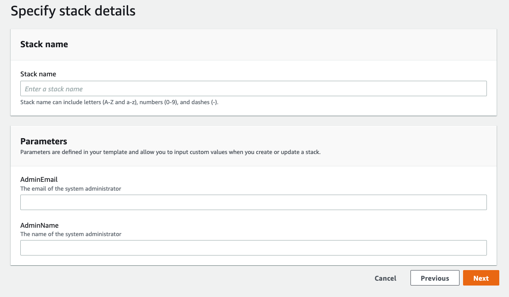
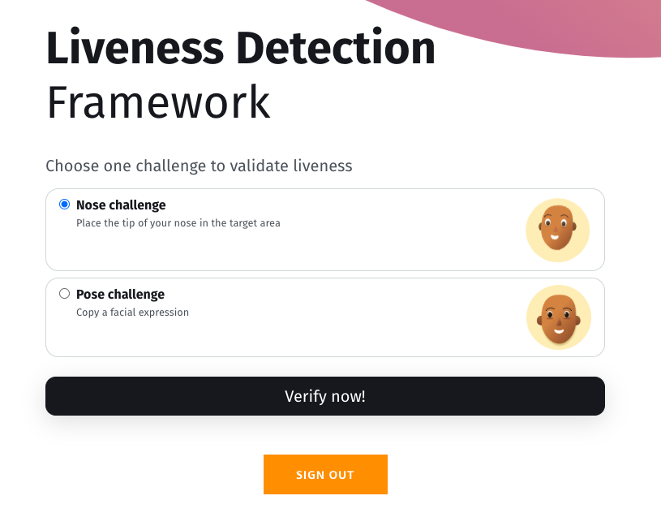
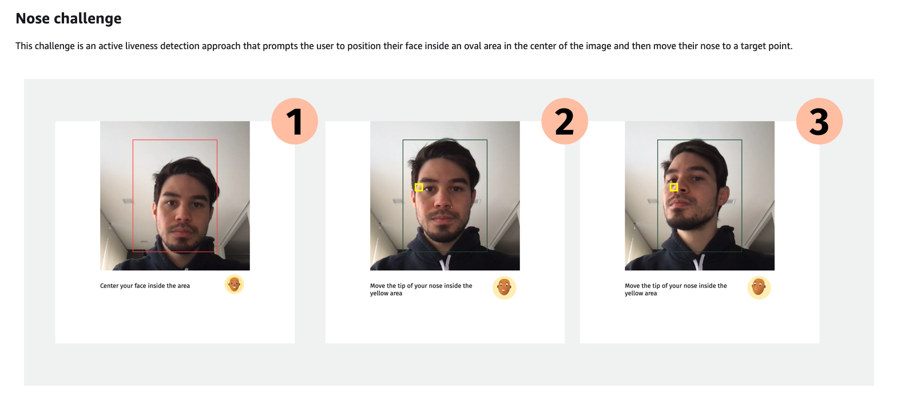
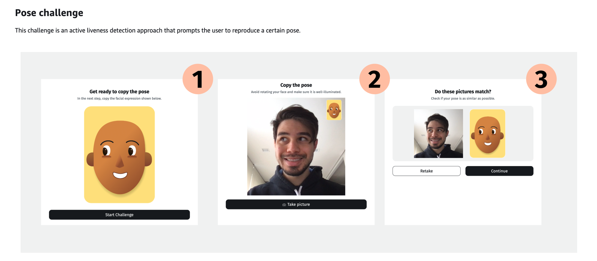
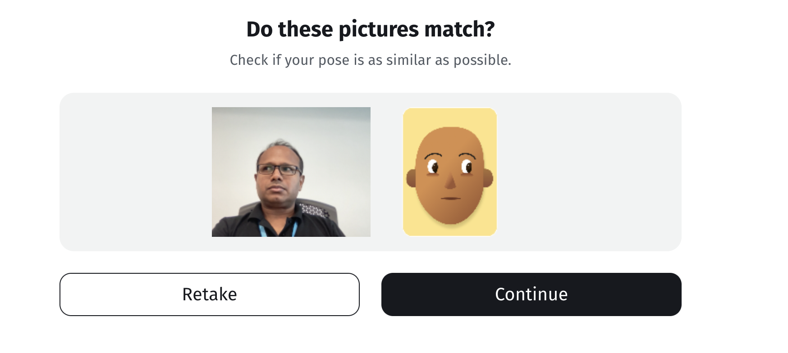
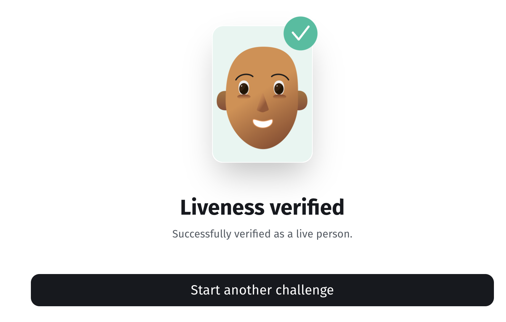

# Incorporate Liveness Detection mechanisms into your applications to address spoofing attacks

Facial recognition has become a widely used mechanism for identity verification applications. Even though current technology is capable of identifying a person's face with high accuracy, counterfeiters still circumvent such systems by impersonating other users by using static photos, video replays, and masks. Such vulnerabilities against spoofing attacks can be overcome by augmenting a facial recognition system with some form of liveness detection. Liveness detection is any technique used to identify spoofing attempts by determining whether the source of a biometric sample is a live human being or a fake representation.

The **Liveness Detection Framework** solution helps you implement liveness detection mechanisms into your applications by means of an extensible architecture. It comprises a set of APIs to process and verify liveness challenges, along with two different types of challenges provided as reference implementations. In addition to those, you can extend the framework and implement your own liveness detection algorithms. This solution also includes a sample web application fully integrated with the APIs. You can use it as a reference to create your own front end that fits your business needs.

## Architecture Overview

We leverage Amazon Rekognition to detect the facial details needed to verify the challenge. The solution’s architecture is composed of a web application that serves as the user front end, and a serverless backend with APIs that are invoked by the front end.

The client device allows the user to access the sample web application. The sample web application captures user images (frames) using the device embedded camera and invokes the solution APIs in the AWS Cloud.

Deploying this solution with the default parameters builds the following environment in the AWS Cloud.

The AWS CloudFormation template deploys the following infrastructure:

- An Amazon CloudFront distribution to serve the web application to the client device.

- An Amazon S3 source bucket to host the sample web application static files (HTML, JavaScript, and CSS).

- Amazon API Gateway to expose the REST/HTTP API endpoints invoked by the client device.

- AWS Lambda function to process API requests. All liveness detection logic runs inside that function.

- An Amazon DynamoDB table to store information about each user’s challenge attempts, such as user ID, timestamp, and challenge-related parameters.

- An Amazon S3 object storage bucket that holds user images captured by the client device and uploaded via the APIs.

- Amazon Rekognition for identifying faces in an image along with their position and landmarks, such as eyes, nose, and mouth.

- AWS Secrets Manager to store the secrets used to sign tokens.

- Amazon Cognito user pool to provide user access control to the API calls.

The framework backend is implemented in Python and built on top of the Chalice microframework. In the backend, the framework architecture provides all of the API implementations and extension points to integrate logic specifically for your application and custom challenges.

The framework’s front-end web application is implemented using React JavaScript library and TypeScript syntax language. The web application is a sample implementation that demonstrates how a client application should interact with the backend APIs and provide a user experience for performing the liveness challenges. Use it as a reference to build a custom web or mobile application.

## Steps

**Step 1. Launch the stack**

This automated AWS CloudFormation template deploys the Liveness Detection Framework solution in the AWS Cloud.

Click on the below link to start deployment of the cloudformation.
https://console.aws.amazon.com/cloudformation/home?region=us-east-1#/stacks/new?templateURL=https:%2F%2Fs3.amazonaws.com%2Fsolutions-reference%2Fliveness-detection-framework%2Flatest%2Fliveness-detection-framework.template

- Keep the default and click **next**

- Give any name for stack name, input a **valid email address** for AdminEmail and a name for AdminName. You will receive your temporary password and username at this address.

- In the next page, leave everything as default.

- In the final page, check the two boxes at the end for acknowledgement and click **create stack**

You can view the status of the stack in the AWS CloudFormation console in the Status column. You should receive a CREATE_COMPLETE status in approximately 7 minutes.

**Step 2. Sign in to the web interface**

After the AWS CloudFormation stack is created, you can sign in to the web interface. The solution sends an email containing your admin credentials, and a temporary password. Use the following procedure to sign in to the web interface for the first time.

- Choose the Outputs tab for the selected cloudformation stack

- Under the Key column you will see WebsiteURL and click on the corresponding link.

- From the sign in page, enter the username and temporary password provided in the invitation email.

- From the Change password page, follow the prompts to create a new password. Password requirements: minimum of 6 characters, requiring at least one upper case character, one lower case character, one number, and one symbol.

- After signing in, select the liveness detection challenge and follow the steps.

Please note that you might be prompted for webcam access for liveness detection. If you want to do live testing, you will need to allow access to your webcam. 

**There are two challenges. Try it out and have fun!!**

## Next Steps
The source code is available for your review and customizations. You can use the solution to build your own liveness detection solution.

The most common use-cases for this framework is to detect spoofing such as using ID photo of another person for verification instead of a real person. Once you verify the liveness, next step can be comparing the face with the ID photo stored for that person to ensure that that is the correct person.

## Resources
- Documentation (https://docs.aws.amazon.com/solutions/latest/liveness-detection-framework/welcome.html)
- source code (https://github.com/aws-solutions/liveness-detection-framework)
- Implementation Guide (https://docs.aws.amazon.com/solutions/latest/liveness-detection-framework/liveness-detection-framework.pdf)

