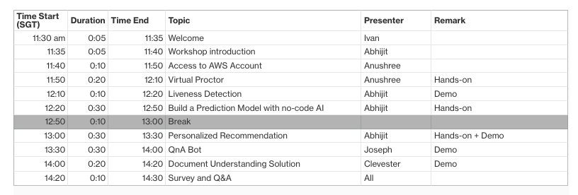

# AI Services Workshop
Welcome to the AWS AI Services Workshop!

`NOTE: Follow the instructions given by the workshop administrators on how to log in to the AWS account provided for this workshop. Do NOT use your personal or business account to run this workshop, as the required pre-built resources will not be available.`

### Prerequisites
- Basic knowledge of AWS AI services
- Attended the AI Services for EdTech webinar
- A computer microphone
- Chrome or FireFox browser

### Agenda

### Service Coverage

### Account Access
In the first step, we will access your temporary AWS account where you will run your labs.

Complete the steps within [0-init](./0-init/README.md) module.

## Solutions
In this workshop, we will go through 5 solutions/ services.

Lets get started!

### Virtual Proctor
Virtual Proctor is a solution that leverages Amazon Rekognition to show a scalable way to conduct online testing.

It shows how you can implement rules such as:
- Detecting objects of interest (such as mobile phone)
- Detecting the number of people present
- Recognizing the person who is taking a test
- Detecting unsafe content (such as explicit adult content or violent content)

Get started with [1-virtual-proctor](./1-virtual-proctor/README.md) module.  

### Liveness Detection 
The **Liveness Detection Framework** solution helps you implement liveness detection mechanisms into your applications by means of an extensible architecture. It comprises a set of APIs to process and verify liveness challenges, along with two different types of challenges provided as reference implementations. In addition to those, you can extend the framework and implement your own liveness detection algorithms. This solution also includes a sample web application fully integrated with the APIs. 

Get started with [2-liveness-detection](./2-liveness-detection/README.md) module.  

### Churn Prediction using SageMaker Canvas (no-code AI)
This helps you build a prediction model for student drop-outs using Amazon SageMaker Canvas. Canvas is a no-code AI tool that provides a visual point-and-click interface and allows you to build models and generate accurate ML predictions on your own without requiring any ML experience or having to write a single line of code.

Get started with [3-churn-prediction](./3-churn-prediction/README.md) module.  

### Creating Personalized Recommendations with Amazon Personalize
This lab helps you build custom recommendation model using Amazon Personalize for your use cases. Amazon Personalize is a fully managed machine learning service that makes it easy for developers to deliver personalized experiences to their users. 
You can use Amazon Personalize in a variety of Education scenarios, such as:
- Generating coursework recommendations for students based on their preferences and behavior
- Personalized re-ranking of course search results
- Recommendation of what course or content might be useful for the students
- Recommendation of Tutors to students
- Creating targeted marketing campaigns based on user segments etc. 

Amazon Personalize does not require any machine learning experience. You can get started quickly using the Personalize console in AWS.

Get started with [4-personalized-recommendation](./4-personalized-recommendation/README.md) module.  

### QnA Bot
AWS QnABot is a multi-channel, multi-language conversational interface (chatbot) that responds to your customer’s questions, answers, and feedback. The solution allows you to deploy a fully functional chatbot across multiple channels including chat, voice, SMS and Amazon Alexa. 

Get started with [5-qna-bot](./5-qna-bot/README.md) module.  

### Document Understanding Solution
The Document Understanding Solution (DUS) delivers an easy-to-use web application that ingests and analyzes files, extracts text from documents, identifies structural data (tables, key value pairs), extracts critical information (entities), and creates smart search indexes from the data. Additionally, files can be uploaded directly to and analyzed files can be accessed from an Amazon Simple Storage Service (Amazon S3) bucket in your AWS account.

Get started with [6-document-understanding](./6-document-understanding/README.md) module.  

